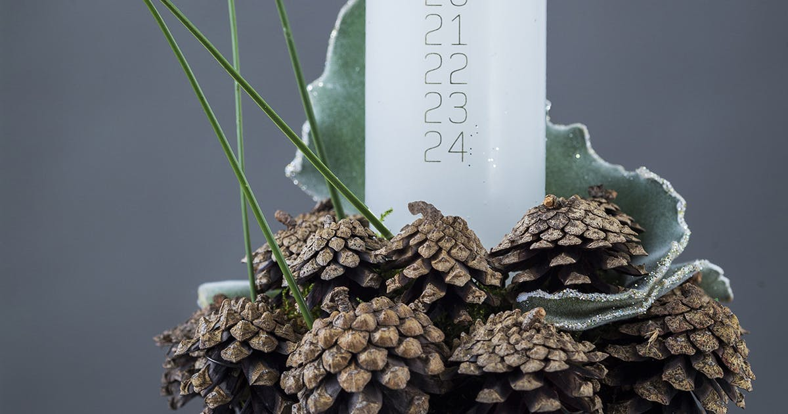
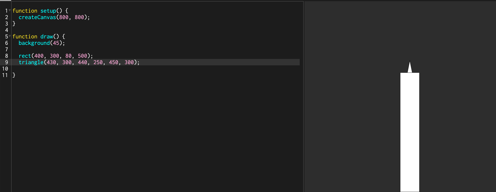

# 🎄 Kaldenderlys - en introduktion til p5.js ☃️



I dette forløb skal I ved hjælp af programmeringssproget JavaScript, samt biblioteket *p5.js*, lave en juledekoration med et kalenderlys, der kan bringe os i julestemning og hjælpe os med at holde styr på dagene op til juleaften.

Ud over at holde styr på tiden skal lyset jo også pyntes. I ren Gertrud Sand stil skal den ikke have for lidt med masser af julepynt så vi rigtig kommer i julesrtemning inden vi tager hjem på juleferie.

[Gertrud Sand](https://bt.bmcdn.dk/media/cache/resolve/image_1240/image/74/746071/11618210-.jpg) fra *the Julekalder*

<br/>

------

> 💡 **Hvad er et bibliotek?**
>
> Et bibliotek, også kaldet library på engelsk, er en samling af funktioner og klasser der gør en bruger i stand til at lave ellers tidskrævende handlinger på en let og hurtigt måde. P5.js er et eksempel på et bibliotek. 

-------

<br/>

------

> 💡 **Hvad er p5.js?**
>
> p5.js er et såkaldt **JavaScript bibliotek for kreativ kodning**, med fokus på at gøre det at kode let tilgægligt for f.eks. kunstnere, designere, undervisere, elever, begynnere mm.  p5.js er gratis og open-source og kan bruges unden installation af nogen art, hvilet gør det nemt og hurtigt at komme i gang med det der er vigtigt, nemlig at skrive kode! 
>
> p5.js er en videreudvikling af Processing...
>
> Du kan finde meget mere på deres hjemmeside [p5js.org](https://p5js.org), hvor der er en online editor og en masse tutorials perfekt til begyndere.

-------

<br/>

## Krav

Der er en række krav som jeres kalenderlys SKAL benytte

Rect()

Ellipse()

Line()

Text()

Fill()

Stroke()

year

month

day

hours

second


I skal lave 


Kernestof


For at komme i gang skal vi lave vores eget kalenderlys. Lyset skal i løbet af December brænde længe og længere ned hen mod juleaften. 🎅🏻


Hvad skal i lære?

Stifte bekendskab med JavaScript

At benytte et bibliotekt kaldet p5.js

At tegne simple figurer ved hjælp af indbygede funktioner

Benytte referencer til et programmeringssprog


Referencer


## p5.js - hvad er function setup() og function draw()?

<br/>


<br/>

Når man opretter et nyt *'tomt'* p5.js projekt kommer det med to funktioner kaldet `function setup()` og `function draw()` . Navnene på de to funktioner beskriver meget godt hvad de skal bruges til. `function setup()`bruges til at afvikle det kode der er brugfor inden vi kan komme igang derfra navnet *setup*.


```javascript
// DETTE ER INDE I FUNKTIONEN OG VIL TEGNE EN RECTANGEL

function draw(){
rect(50,50, 30,25);
}

// DETTE ER UDENFOR FUNKTIONEN OG VIL GIVE JER EN FEJL

function draw(){

}
rect(50,50, 30,25);

```


⚠️  Man kan kun bruge p5.js funktioner inde i setup eller draw(). Hvis i skriver 

### Kodeblok og scope

I de fleste programeeringssprog bruger man { } til at fortælle computeren hvilken kode der hører til hvilken kodeblok. 


## 🚦Rød, gul, grøn

Dette forløb følger metoden rød, gul, grøn der er en metode til differentiering af opgaver alt efter hvor meget støtte man behøver. Rød er med mindst støtte, gul lidt mere og til sidst grøn med meget støtte. Jeg vil anbefale at man minimum vælger gul, da det er vigtigt at man presser sig selv en lille smule, ellers lærer i ikke noget. 

</br>

### 🟥 Rød

Lav et kalenderlys der automatisk tæller ned med juleaften. Lyset skal følge år, dato og tid på dagen. Der skal også laves pynt til dekorationen såsom gran, kugler, nisser eller lignende. Hvis alt dette nåes kan man også lege med animation i form af gifs af flammen samt lyd.

</br>

### 🟨 Gul

### Tegn et lys

- Lav en rektangel og giv den postition og størrelse du øsnker.
- Tegne en trekant som flamme så den står øverst på rektanglen som en flamme.
- 

Lav en trekant.

Brug de indbyggede funktioner funktionerne

</br>

### 🟩 Grøn

#### Canvas og baggrund

Inden vi kan begynde at lave vores juledekoration med kalenderlys skal vi lave et sted hvor vi kan vise hvad vi tegner. For at kunne dette opretter vi et canvas hvorpå vi kan tegne.

```javascript
function setup(){
  createCanvas(800, 800); //opretter et canvas der er 800 pixels bred og 800 pixels høj
}

function draw(){
  background(220); //giver canvas en farve
}
```

</br>

> 💡 **Baggrundsfarve**
>
> Funktionen `background()` kan tage ét eller tre parametre. Hvis vi giver den ét parameter mellem 0 og 255 tegner den en ensfarvet baggrund i gråtoner, f.eks. `background(127)`. 0 er sort og 255 er hvid. 
>
> Hvis man øsnker noget andet end gråtoner kan man bruge tre parametre. Hver parameter kan være mellem 0 - 255. Hvis jeg f.eks. ønsker at bruge farven gul kan jeg skrive `background(255, 204, 0);`
>
> `background(rød, grøn, blå)`
>
> [Referencen](https://p5js.org/reference/#/p5/background) til funktionen background.

</br>

> ✏️ **Vælg en baggrundsfarve**
>
> - Læs om funktionen `background()` i referencen.
>
> - Vælge en baggrundsfarve der passer til jeres juledekoration.

</br>

#### Tegn et kalenderlys

Lad os starte med at tegne selve lyset. Til at tegne voksen på lyset bruger vi funktionen `rect()`. 

`rect()` skal bruge 4 værdier som vi kalder *parametre* for at tegne et rektangel. Den skal placeres et sted på vores Canvas så den skal have en *x-værdi* og en *y-værdi*. 

For at lave et simpelt lys kan vi tegne et rektangel midt på siden, der rører bunder og har lidt luft op til toppen.

</br>

##### Starin

```javascript
// FOR AT KODEN SKAL VIRKE SKAL DEN SÆTTE IND I DRAW()

function setup() {
  createCanvas(800, 800);
}

function draw() {
  background(45);

  rect(400, 300, 80, 500); //<--Nyt
}
```

</br>


</br>

##### Flammen

For at vise at vores kalenderlys tæller ned til juleaften skal vi have tændt lyset. For at vise at lyset er tændt skal vi lave en simpel flamme. Til det skal vi bruge funktionen `triangle()`, der tager seks parametre (tre koordinat-par) et for hver hjorne i trekanten.

</br>

`triangle(x1, y1, x2, y2, x3, y3)`


```javascript
function setup() {
  createCanvas(800, 800);
}

function draw() {
  background(45);

  //stearin
  rect(400, 800, 80, -500/24 * 24);
  
  //flammen
  triangle(430, 300, 440, 250, 450, 300);
   
}
```


</br>



</br>

###### Individuelle farver

Hvad der hurtig bliver klart er, at alle vores former har det samme udseende. Sort omrids med hvidt fyld. Men heldigvis er det muligt i p5.js at ændre på dette, igen med nogen af de indbyggede funktioner. Som i mange billedredigeringsprogrammer, Photoshop etc. hedder omridset `stroke()`og fyld hedder `fill()`. 


> ✏️  **Individuelle farver**
>
> - Giv stearinen og flammen hver sin farve ved at bruge funktionerne `fill()` og `stroke() ` til i får det udtryk i ønsker.


#### Tekst og tal


> 💡 **Løkker**
>
> Når man programmere komme man ofte ud for at man ønsker at gentage den samme ting igen og igen med meget få ændringer. Det kan hurtigt blive ensformigt og kan resultere i fejl der kan være svære at finde.


OPGAVE put tal på dit lys

Nu er selve lyset tegnet, der er en flamme, stearin samt 

#### Hvad dag er det?

----

Mere følger