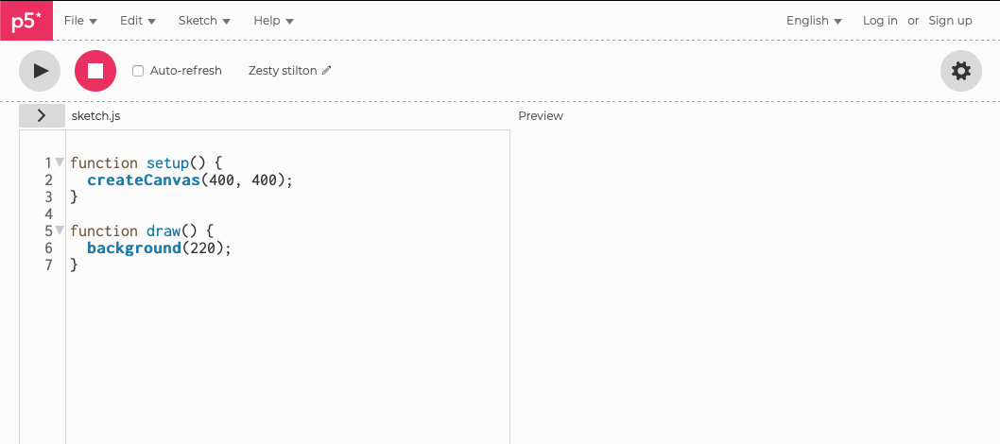
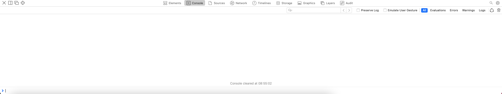
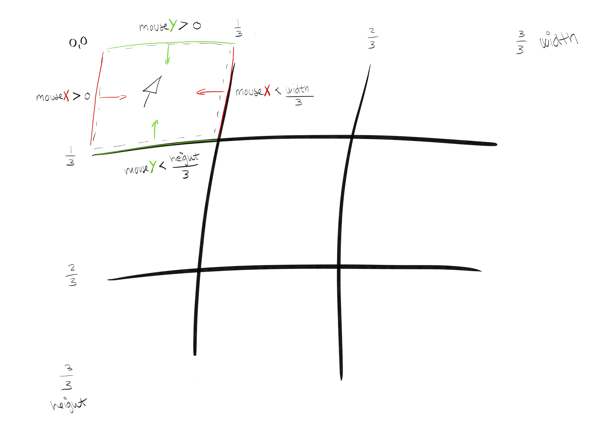

# Kryds og Bolle
*af Jeppe Veirum Larsen, opdateret 28/4 2022*
<br>

I dette forløb vil i lære at lave brætspillet kryds og bolle. Forløbet vil introducere jer til de mest basale elementer inden for spilopbygning. Hvordan kan man placere en brik, hvordan ved computeren om der er en brik eller ej? hvis tur er det? er der nogen der har vundet? Alt jeres viden vil blive brugt til at sammensætte et helt spil hvor vi får mulighed for at sætte vores viden i spil.
<br>

> **I dette forløb komme vi til at arbejde med**
>
> - JavaScript og p5.js
>
> - Variabler
> - Forgreninger
> - Løkker
> - Funktioner
>

<br>

> ⛔️ Det er OK at hjælpe hinanden med forklaringer og fejlfinding etc., men at få kodestumper eller få andre til at lave koden lære i intet af. 


## Hvad er Kryds og bolle?
Kryd og bolle er et simpelt brætspil som de fleste i verden kender. Spillet er for to spillere der på tur skiftes til at ligge deres brik, kryds eller bolle, på et 3 x 3 spillebræt, på et papir eller i sandet på stranden. Vinderen er den der først har fået tre på stribe. Der findes 'to' udgaver af spillet. Det ene er at man fylder pladen ud og spillet kan ende uafgjort den anden er hvor man får tre brikker hver og spiller ind til at én spiller får tre på stripe.


<br>

> ⚠️ I dette forløb tager vi udgangspunkt i den version hvor hele pladen fyldes op af brikker og kan resulterer i uafgjordt.

<br>

## En model af Kryds og Bolle

Inden der programmeres er det en god ide at skabe sig et overblik over det man ønsker at lave. En af måderne af skabe overblik er at lave en model af logikken i programmet.

<br>

> ❓En *model* en simplificering af virkligheden, og i programmering er det ofte lavet ved hjælp af tekst, kasser og streger osv. Dette skaber overblik og giver os mulighed for at overveje og planlægge vores program uden at skrive én eneste linje kode. Der findes rigtig mange modeller, hvor det klassiske eksempel er Flowcharts, der finder flere som f.eks. klasse diagrammer, men dem kommer vi til i et andet forløb.

<br>

Inden en model kan påbegyndes skal der opstilles nogle krav, der siger hvad vi vil. I dette tilfælde, hvor vi har at gøre med et eksisterende spil, er kravene givet på forhånd gennem spillets regler. Hvis du er i tvivl er [reglerne her](https://da.wikipedia.org/wiki/Kryds_og_bolle).

Men hvordan ved vi *hvornår* forskellige ting sker i kryds og bolle? For os der er udstyret med en hjerne er det sjældet et problem at overskue et så simpelt spil, men vi er nødt til at forstå det ned til mindste detalje før vi kan forklare en computer hvordan en runde kryds og bolle forløber.

<br>

> 📚 **OPGAVE**
>
> Tag et stykke papir og skriv ned hvad det er to spillere gør, skridt for skridt, fra spillet findes frem til de ikke vil spille mere.

<br>

### Flowchart

Til at visualisere en process eller et flow gennem et system er det meget almindligt at bruge et såkaldt *Flowchart*. I er sikkert stødt på en eller anden form for form flowchart lignende modeller tidligere. I programmering giver de rigtig meget mening, da de minder en del om visuel [pseudo kode](https://www.youtube.com/embed/4S5ckWkMnMU).

https://www.youtube.com/embed/4S5ckWkMnMU

<br>


<br>

Klik på linket for at få en detaljeret beskrivelse af [flowchart symbolerne](https://www.smartdraw.com/flowchart/flowchart-symbols.htm).

<br>


## Kode-editor

For at kunne skabe spillet skal vi have et sted og skrive og køre vores kode. Det letteste er at bruge [p5.js egen online editor.](https://editor.p5js.org) Her kan du skrive koden i det venstre vindue og se resultatet i det højre. Det køre udelukkende online i din browser. Ved at lave en bruger kan man logge ind og gemme sin kode til senere, dele koden med underviser, venner og familie så de nemt kan se hvordan det går fremad.

<br>



<br>

Den mere avancerede løsning er at bruge en kode editor såsom Microsofts Visual Studio Code (VS Code). Den er en meget populær kode editor som bruges til mange forskellige sprog ikke kun JavaScript. For at køre vores kode skal vi bruge en server. Dette kan heldigvis gøre let ved at bruge modulariteten af VS Code igennem de såkaldte *extendions*. Installer LiveServer extension i VS Code og genstart programmet. Nu kan du clicke på Go Live i nederste højre hjørne og se resultatet af din kode.


<br>

For at kunne debugge din kode skal du bruge en konsol til at se de fejlmeddelelser som kommer i tilfælde af fejl. Højreklik på Canvasset og klik på inspicer eller lignende og 




## Implementering af kryds og bolle

Modsat hvad mange tror er en computer dum. Endda meget dum. Den ved intet selv, den er nødt til at få det hele at vide. Det er her i som programmøre kommer ind i billedet.

### En forskel mellem fysiske og digitale spil og programmer

De spil vi har i den fysiske verden er ikke overraskende anderledes end de digitale. De er forskellige på mange måder, men en af de måder de adskiller sig på, som kan være forvirrende for aspirerende programmøre, er at i den fysiske verden har de fysiske objekter muligheden for at bære information, f.eks. positionen af en brik, penge i Matador, farven på brikken eller typen af brikken osv.

I den digitale verden er det noget anderledes. Alt hvad vi ser på en skærm er en representation af bagvedliggende information eller data. En *Health bar* i et spil er f.eks. en grafisk representation af en variabel som indeholder en værdi som er den mængde liv spilleren har tilbage. Hvis den variabel ikke fandtes var der ikke noget at vise grafisk.

Derfor er vi nødt til som programmøre at generere informationer inden vi kan vise dem grafisk på en skærm. 

### Spillepladen

Det første vi har brug for er en spilleplade med 9 felter, så vi har noget at gå ud fra. Der er flere forskellige måder hvorpå vi kan lave 9 felter, men lad os gå ud fra hvad mange nok vil syntes er den mest simple metode.

#### Tegn de 9 felter

Den hurtigste måde at lave en 3 x 3 spilleplade på f.eks. et stykke papir er, at slå 4 streger der krydser hinanden, se nedenfor. 

For at tegne en linje bruges den indbygge funktion fra p5.js `line()`, se [referencen](https://p5js.org/reference/#/p5/line) for flere detaljer.


```javascript
// EKSEMPEL PÅ EN LINIE TEGNET I p5.js

// line bruger to koordinat punkter, line(x1, y1, x2, y2), hvor imellem der tegner en linie.

line(10, 10, 25, 25); // Her tenes en linie melle (10,10) og (25,25)

```

<br>

> 👀 **SE HVAD DER SKER**
>
> Prøv at kopier kodestykket ind i din kode-editor og se hvordan liniestykket ændre sig når du justere på de forskellige parametre (de fire tal i parentesen.

<br>

Når du er blevet fortrolig med `line()` og fundet ud af hvad de forskellige parametre ændre på, er det tid til at tegne de fire streger der udgør vores spilleplade.

I forløbet vil vi tegne vores ting relativt til vores bredde og højde af vores canvas. 

```js
//Vi kan tegne den første lodrette streg på to måder
//Vi går i eksemplet her ud fra at vores canvas er 600 x 600

//line(x1, y1, x2, y2)

line(200, 0, 200, 600)

//Her benytter vi os af de indbyggede variabler width og height. Det gør vi så at vi kan ændre på vores opløsning senere hvis vi skulle få lyst til det.

line(width/3, 0, width/3, height)
```


<br>

> 📚 **OPGAVE** 
>
> Tegn linierne med ***1/3 afstand af bredden og højden mellem hver linie***, se figuren nedenunder, så du ender med en spilleplade nogenlunde som på billedet, med 9 lige store felter.


### Hvor er felterne?

Nu har vi tegnet vores felter, men vi har et problem. Vi har ind til nu farvet nogle pixels på en skærmforstørrelse at lave linjer, men problemet er at computeren ikke ved at disse 4 linjer skaber 9 felter, som vi er meget interesseret i, at kunne bruge til vores spil . Så næste skridt er at gøre computeren i stand til at skelne mellem  disse 9 felter.


#### Musen

Vi kan som bruger primært interagere med computeren ved hjælp af mus eller tastatur. I dette tilfælde med kryds og bolle vil vi gerne benytte musen.

Det vi skal vide noget om er musens position i forhold til de tegnede felter.

```javascript
// HEJ MUS

//Lad os sige hej til musen og se hvor den er. Det gør vi ved at skrive dens position til consol med console.log() ind i vores draw().

console.log(mouseX, mouseY)
```

<br>

##### Hvordan bruger vi mouseX og mouseY

Nu vi har fået adgang til musens position i **x-** og **y-aksen** så vil vi gerne kunne bestemmer noget ud fra musens position. 

```js
//indsæt i draw()
//hvis muser er mere end halvvejs over x-aksen (bredden af kanvas), gør stregerne røde eller lad dem forblive sorte.

function setup(){
  
}

function draw(){
  
	if(mouseX > width/2){
  	stroke(255,0,0);
	}else{
  	stroke(0,0,0);
	}
  
}

```


#### Hvordan finder vi det første felt?

Nu vi har musens position, mangler vi at finde en måde at beskrive felternes position. I programmering er vi nødt til at beskrive 'rammerne' sådan at vi kan checke at vi er inde i et bestemt felt eller område.

Vi ved at vores spilleplade er delt op i 9 lige store felter 3x3 dvs. at de alle sammen er 1/3 af pladens bredde og 1/3 af pladens højde.

<br>

> ⚠️ Husk at y-aksen er positiv ned ad, modsat hvad i normalt bruger.

<br>

I figuren herunder kan vi se at vi kan beskrive et felt, her den øverste i venstre hjørne, ved at beskrive hvor `mouseX` og `mouseY` er i forhold til opdelingen af spillepladen da vi ved at hvert felt er 1/3 x 1/3. Vi kan beskrive et rektangulært område ved at sige at musen skal være på en bestemt side hvis musen er på den rigtige side af alle fire streger må den være inde i det definerede område, se figuren neden under.



<br>

Vi kan nu bruge vores `if()` til at checke om musen er inde i et givent felt.

```js
//Definition af ØVERSTE VENSTRE felt

let felt = 0// Vi opretter en global variabel til at gemme vores position

setup(){
  
}

draw(){

  //**********************
    //Hvis alle disse fire udsagn er sande befinder musen sig inden for 		feltet.
	if(mouseX > 0 && mouse X < witdh/3 && mouseY > 0 && mouseY < height/3){

  	felt = 1; //vi ændre vores position.
  	console.log(felt);
	}
  //***********************
}
```

<br>

> 📚 **OPGAVE**
>
> Ud fra eksemplet ovenfor lav de resterende 8 felter og skriv det korrekte til for feltet til console.
>
> 
>
> 🤯 Hvis i er færdige tænk over hvordan man kan bruge jeres viden om 2D løkker fra 10-Print til at gøre koden mere overskuelig og lettere at vedligeholde.


<br>

### Hvordan ved jeg hvad der er på felterne

Her laver vi et array 1d eksempel


### Hvis tur er det?


### Placer en brik

Hvordan placerer vi brikker med mouse pressed.


### Ulubuluuu brikker hvor er i henne?

Hvordan tegner vi brikerne


