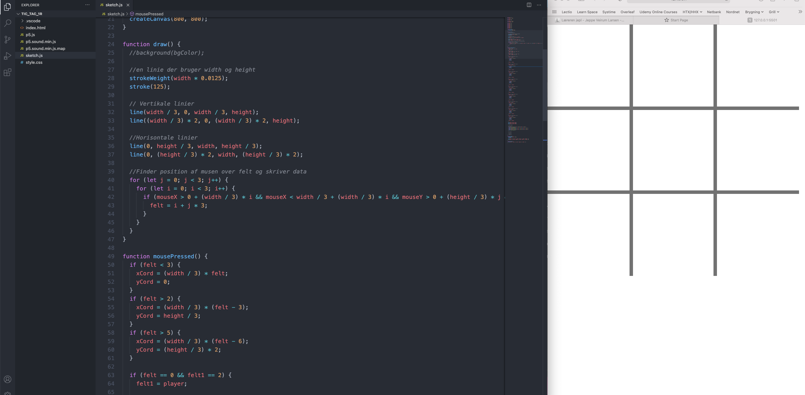

# Kryds og Bolle
*af Jeppe Veirum Larsen, opdateret 5/2 2021*
<br>

I dette forløb vil i lære at lave brætspillet kryds og bolle. Forløbet vil introducere jer til de mest basale elementer inden for spilopbygning. Hvordan kan man placere en brik, hvordan ved computeren om der er en brik eller ej? hvis tur er det? er der nogen der har vundet? Alt jeres viden vil blive brugt til at sammensætte et helt spil hvor vi får mulighed for at sætte vores viden i spil.
<br>

> **I dette forløb komme vi til at arbejde med **
>
> - JavaScript og p5.js
>
> - Variabler
> - Forgreninger
> - Løkker
> - Funktioner
>


[toc]


## Hvad er Kryds og bolle?
Kryd og bolle er et simpelt brætspil som de fleste i verden kender. Spillet er for to spillere der på tur skiftes til at ligge deres brik, kryds eller bolle, på et 3 x 3 spillebræt, på et papir eller i sandet på stranden. Vinderen er den der først har fået tre på stribe. Der findes 'to' udgaver af spillet. Det ene er at man fylder pladen ud og spillet kan ende uafgjort den anden er hvor man får tre brikker hver og spiller ind til at én spiller får tre på stripe.


<br>

> ⚠️ I dette forløb tager vi udgangspunkt i den version hvor hele pladen fyldes op af brikker og kan resulterer i uafgjordt.

<br>

## En model af Kryds og Bolle

Inden der programmeres er det en god ide at skabe sig et overblik over det man ønsker at lave. Overblikket er ofte en model af logikken i programmet.

> ❓ I programmering er en *model* en simplificering af det vi ønsker at lave. Det skaber overblik og giver os mulighed for at overveje og planlægge vores program uden at skrive én eneste linie kode. Der findes rigtig mange modeller, hvor det klassiske eksempel er Flowcharts, men UML klasse diagrammer er også meget brugt til mere avancerede programmer. 

Inden en model kan påbegyndes skal der opstilles nogle krav. I dette tilfælde, hvor vi har at gøre med et eksisterende spil, er kravene givet på forhånd gennem spillets regler. Hvis du er i tvivl er [reglerne her](https://da.wikipedia.org/wiki/Kryds_og_bolle).

Men hvordan ved vi *hvornår* forskellige ting sker i kryds og bolle? For os der er udstyret med en hjerne er det sjældet et problem at overskue et så simpelt spil, men vi er nødt til at forstå det ned til mindste detalje før vi kan forklare en computer hvordan en runde kryds og bolle forløber.

<br>

> 📚 **OPGAVE**
>
> Tag et stykke papir og skriv ned hvad det er to spillere gør, skridt for skridt, fra spillet findes frem til de ikke vil spille mere.

<br>

### Flowchart

Til at visualisere en process eller et flow gennem et system er det meget almindligt at bruge et såkaldt *Flowchart*. I er sikkert stødt på en eller anden form for form flowchart lignende modeller tidligere. I programmering giver de rigtig meget mening, da de minder en del om visuel [pseudo kode](https://www.youtube.com/embed/4S5ckWkMnMU).

https://www.youtube.com/embed/4S5ckWkMnMU

<br>


<br>

Klik på linket for at få en detaljeret beskrivelse af [flowchart symbolerne](https://www.smartdraw.com/flowchart/flowchart-symbols.htm).

<br>


## Kode-editor

For at kunne skabe spillet skal vi have et sted og skrive og køre vores kode. Det letteste er at bruge [p5.js egen online editor.](https://editor.p5js.org) Her kan du skrive koden i det venstre vindue og se resultatet i det højre. Det køre udelukkende online i din browser. Ved at lave en bruger kan man logge ind og gemme sin kode til senere, dele koden med underviser, venner og familie så de nemt kan se hvordan det går fremad.

<br>


<br>

Den mere avancerede løsning er at bruge en kode editor såsom Microsofts Visual Studio Code (VS Code). Den er en meget populær kode editor som bruges til mange forskellige sprog ikke kun JavaScript. For at køre vores kode skal vi bruge en server. Dette kan heldigvis gøre let ved at bruge modulariteten af VS Code igennem de såkaldte *extendions*. Installer LiveServer extension i VS Code og genstart programmet. Nu kan du clicke på Go Live i nederste højre hjørne og se resultatet af din kode.



<br>

For at kunne debugge din kode skal du brge en konsol til at se de fejlmeddelelser som kommer i tilfælde af fejl. Højreklik på Canvasset og klik på inspiser eller lignende og 


## Implementering af kryds og bolle

Modsat hvad mange tror er en computer dum. Endda meget dum. Den ved intet selv, den er nødt til at få det hele at vide. Det er her i som programmøre kommer ind i billedet.

### Spillepladen

Det første vi har brug for er en spilleplade med 9 felter, så vi har noget at gå ud fra. Der er flere forskellige måder hvorpå vi kan lave 9 felter, men lad os gå ud fra hvad mange nok vil syntes er den mest simple metode.

[P5.js reference][1]


#### Tegn de 9 felter

Den hurtigste måde at lave en 3 x 3 spilleplade på f.eks. et stykke papir er, at slå 4 streger der krydser hinandenen, se nedenfor. 

For at tegne en linie bruges den indbygge funktion fra p5.js `line()`, se [referencen](https://p5js.org/reference/#/p5/line) for flere detaljer.


```javascript
// EKSEMPEL PÅ EN LINIE TEGNET I p5.js

// line bruger to koordinat punkter, line(x1, y1, x2, y2), hvor imellem der tegner en linie.

line(10, 10, 25, 25); // Her tenes en linie melle (10,10) og (25,25)

```

<br>

> 👀 **SE HVAD DER SKER**
>
> Prøv at kopier kodestykket ind i din kode-editor og se hvordan liniestykket ændre sig når du justere på de forskellige parametre (de fire tal i parentesen.

<br>

Når du er blevet fortrolig med `line()` og fundet ud af hvad de forskellige parametre ændre på, er det tid til at tegne de fire streger der udgør vores spilleplade.

I forløbet vil vi tegne vores ting relativt til vores bredde og højde af vores canvas. 

```js
//Vi kan tegne den første lodrette streg på to måder

line()
```


<br>

> 📚 **OPGAVE** 
>
> Tegn linierne med ***1/3 afstand af bredden og højden mellem hver linie***, se figuren nedenunder, så du ender med en spilleplade nogenlunde som på billedet nedenunder, hvor hvert felt er lige stort.


### Hvor er felterne?

Nu har vi tegnet vores felter, men vi har et problem. Vi har ind til nu farve nogle pixels på en skærm i en række efter hinanden, men problemet er at computeren ikke ved at disse 4 linier skaber 9 felter, som vi er meget interesseret i, at kunne bruge til vores spil . Så næste skridt er at gøre computeren i stand til at skelne mellem  disse 9 felter.


#### Musen


Nu har vi en spilleplade lavet af 4 streger. Den er kun visuel og vi kan ikke 'bruge den til noget' endnu da computeren ikke ved hvor de forskellige felter er på pladen. Vi kan ved hjælp


P5.js 


[1]: https://p5js.org/reference/

