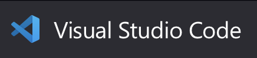
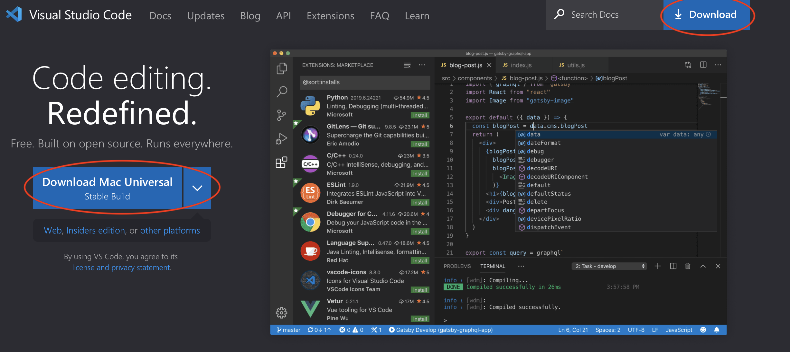
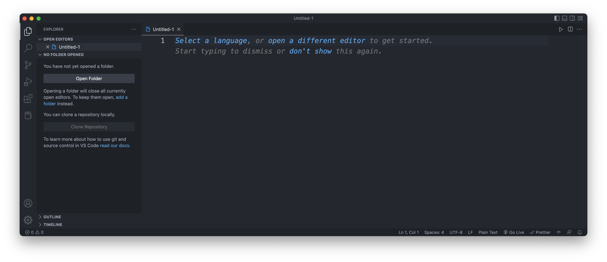
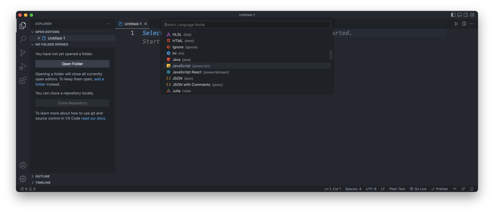
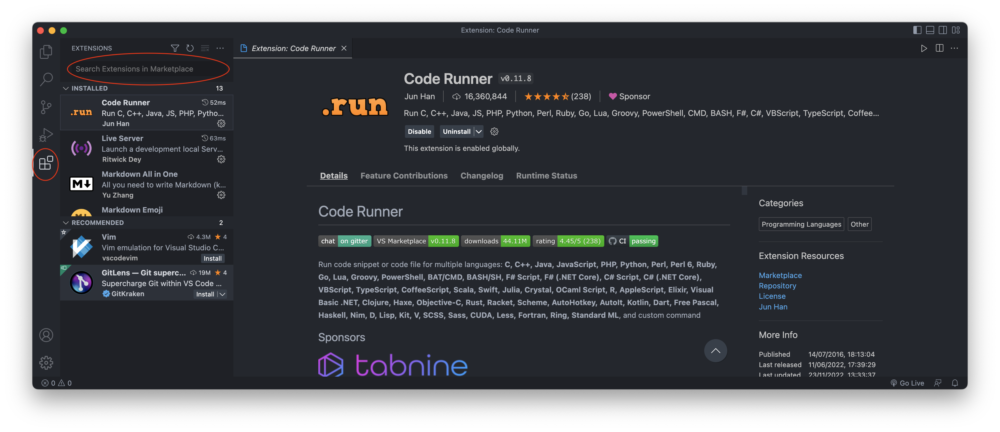
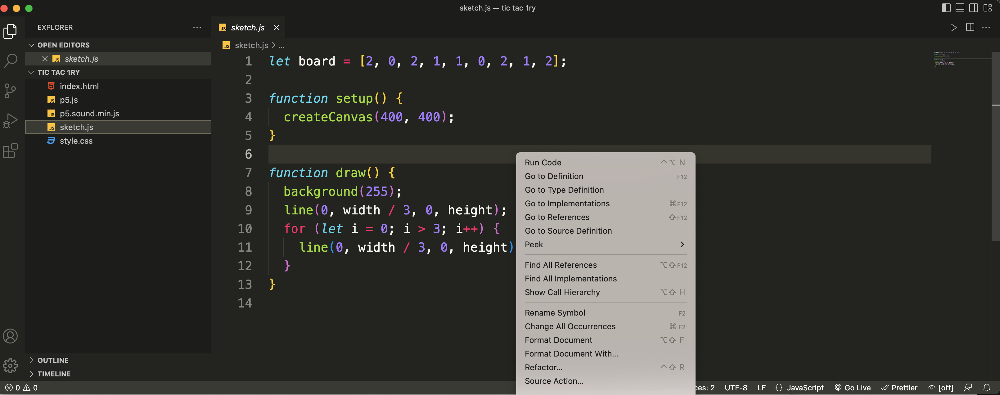
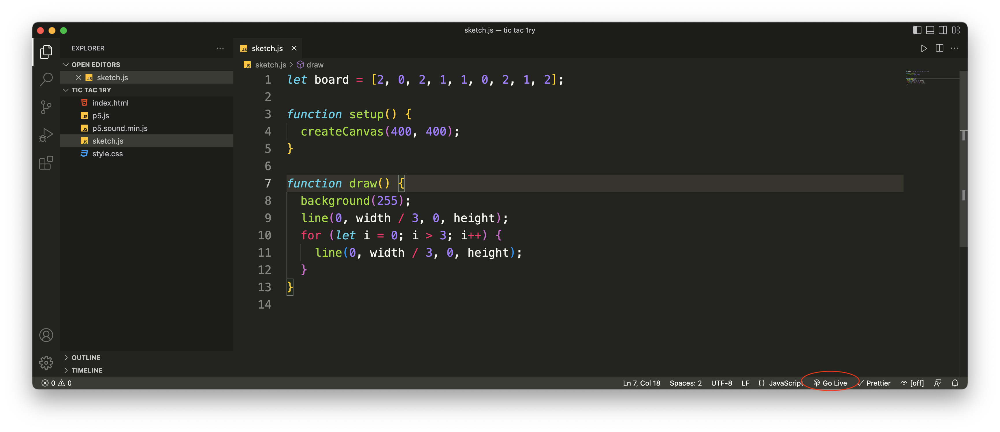

# Visual Studio Code

*Af Jeppe Veirum Larsen, opdateret 18/11 2022*

 

I undervisningen vil vi komme til at bruge code editoren Visual Studio Code (VS Code). Det er en meget populær code editor som kan bruges til nærmest alt. En af grundende til VS Codes popularitet er dens modulære opbygning der gør at den kan udvides med en masse ekstra funktionalitet, der gør det muligt at skrædersy den til lige netop det man skal bruge.

Dette dokument viser hvordan man henter og installere VS Code samt hvilke udvidelser vi skal bruge for at komme godt i gang.

## Installation

Det første vi skal er at downloade VS Code. Det er ikke så vigtigt hvor i installere det, det må bare ikke installeres i dynamiske mapper så som oneDrive, dropbox eller lignende.

 

🔗 [Download af VS Code](https://code.visualstudio.com/Download)

 

## Opret, åben og gem en fil

Dette er nok indlysende for de fleste, men vi gennemgår lige hvordan vi opretter en fil, åbner en mappe med forskellige filer samt hvordan vi gemmer en fil.

### Opret fil

For at oprette en fil skal i gå til *File > New File...* eller den bedste måde ved at bruge genvejen *ctrl+n / cmd+n*. 

Når den nye fil er nyoprettet er det muligt at vælge programmeringssprog ved at klikke på det blå *Select a language og ud fra drop down menuen vælge det ønskede sprog, se billederne nedenunder.

 

 

### Gem en fil

Det at gemme sit kode er det vigtigste når man programmere. Der er intet være end at miste en masse arbejde. *Ctrl+s / cmd+s* gemmer og i skal bruge den flittigt. Når filen gemmes første gang bliver man bedt om at vælge hvor man vil gemme filen og hvad den skal hedde. Her er det vigtigt at man gemmer den i en folder hvor hele projektet er og man har styr på hvor den er samt at tilnavnet er sigende så man ved hvad det handler om. Så glem test, test1 test2, untiteled... etc. 

Når vi gemmer en fil er det vigtigt at kontrollere om filen har den rigtige filendelse og hvis ikke så huske at give den det rigtige endelse når vi gemmer den første gang. 

**Et par eksempler på filendelser:**

- **.js** (JavaScript)
- **.py** (Python)
- **.txt** (Tekstfil)
- **.md** (Markdown)
- **.html** (Hyper Text Markup Language)
- **.css** (Custom Style Sheets)

### Åben en folder

Ofte har vi brug for nemt at danne os et overblik over en samling af filer, da et program ofte indeholder mange filer. Dette gøres ved at bruge *File > Open Folder...* og så vælge den folder man ønsker at åbne. Så viser VS Code alle folderens filer ude til venstre og vi kan nemt vælge og skifte mellem filerne.

## Extensions
Extensions er essentielle for VS Code. Uden extensions er VS Code bare *"endnu en anden kode-editor"*. Ved hjælp af extension kan VS Code skræddersyes lige præcis som man vil have det. 

Extension kan installeres ved at trykke på 'klods-ikonet' til venstre, se figur nedenfor. Her kan man se sine installerede Extensions samt nogle anbefalede. De fleste extensions skal findes ved at bruge search baren i toppen af Extension menuen. Tryk på den Extension man ønsker og klik på Install i toppen af vinduet til højre.

 

 

### Krævede Extensions

I programmering er der en række extensions vi skal bruge i undervisningen på forskellige måder. Nogle af dem udvider Vs Code med ekstra funktionalitet, andre gør det pænere og andre endnu gør vores liv lidt lettere.

#### Color Themes
Lad os starte ud med noget af det mest synlige. Det første der møder øjet er editoren og hvordan den ser ud. Der er allerede en del indbyggede themes, men på market place kan man finde en masse, hvis ikke de indbyggede er noget kan bruge. Følg linket neden under for en guide. 

🔗 [Color Themes Documentation](https://code.visualstudio.com/docs/getstarted/themes)

#### Vscode-icons
En ekstension som sætte små farvede ikoner foran filerne i et projekt for at man hurtigere kan genkende forskelige filtyper.

#### Prettier
For at undgå fejl og øge læsbarheden af kode kan denne ekstension auto-formatere din kode sådan at den er konsistent og ensartet.

Man kan vælge manuelt at køre Prettier eller man kan vælge at sætte den til at køre ved bestemte handlinger. 
En af de mest brugte handlinger til at kører Prettier er når man gemmer sin fil. Følg linket neden under for at formatere koden når i trykker ctrl/s eller cmd/s.

Ved hjælp af Prettier kan I gå fra dette rod!

 

Til dette!

 

For at sætte Prettier op til at kører når i gemmer følg linket herunder.

🔗 [Prettier - Format on svave!](https://scottsauber.com/2017/06/10/prettier-format-on-save-never-worry-about-formatting-javascript-again/)

#### Run Code
Et uundværligt lille værktøj når man hurtig skal prøve et stykke kode.

Installer. Herefter kan man højreklikke på koden og trykke *Run Code* øverst i menuen.

 

#### Live Server

En extension som gør det muligt at kører en lokal web-server. Dette skal primært bruges i forbindelse med p5.js bibloteket. For at køre Live Server skal i trykke på Go Live og en fane i jeres browser vil åbne og køre jeres kode hvis det understøttes.

