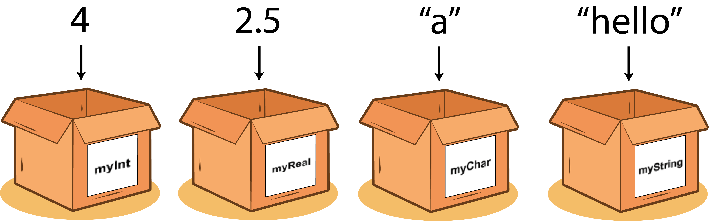

# Variabler

*af Jeppe Veirum Larsen, senest opdateret Dec. 2022*

**Fag:** Programmering c&nbsp; &nbsp; &nbsp; &nbsp;&nbsp; &nbsp; &nbsp;**Sprog:** JavaScript

<br/>



<br/>

Variabler er en af grundpillerne i programmering. Variabler bruges i alle programmer og bruges til at holde på værdier såsom tal, tekst, boolske værdier og meget mere. Dette dokument gennemgår hvad en variabel er, hvilke typer der findes og hvordan de bruges.

<br/>

 **Emner**

- Hvad er en variabel

- Hvad er datatyper

- Oprette en variable
- Basal aritmetik i programmering

- Ændre typen af variablen

- Skrive til konsollen
- Konstanter

<br/>

## Hvad er en variabel?

Udtrykket *variabel* bruges i mange forskellige sammenhænge og mange kender det måske fra matematik. I matematik bruges en variabel f.eks. ***a*** eller ***x*** til at beskrive en ukendt mængde der kan ændre sig, eller variere, derfra navnet ***variabel***. I datalogi repræsenterer en variabel allokering af hukommelse til opbevaring af en eller anden form for data. Men hvordan ser en variabel ud? Lad os tage et lille eksempel. I eksemplet herunder opretter vi en variabel med navnet ***a*** og vi giver den værdien ***2***.
<br/>
<br/>

**Eksempler på oprettlse af varialer i forskellige programmeringssprog**

``` javascript
// JavaScript

let a = 2;

```

<br/>

```c++
// C++

int a = 2;
```

<br/>

````java
// Java

int a = 2;
````

<br/>

```python
# Python

a = 2
```

<br/>

Eksemplet ovenfor kan nok se lidt fremmed ud for folk, der aldrig før har stiftet bekendskab med programmering. Lad os se på JavaScript eksemplet.

Det første vi skriver er ordet ***let***. Dette er det første der skal skrives når man ønsker at oprette en *ny* variabel. Herefter skal variablen have et navn, som i dette tilfælde er ***a***. Dernæst kommer ligmed tegnet ***=*** , der i programmering bruges til at tildele noget en værdi, som her i eksemplet bliver variablen med navn ***a*** tildelt værdien ***2***. Til sidst afsluttes oprettelsen med semicolon ***;*** der giver tegn til computeren, at vores instruktion slutter her. 


```javascript
//Her er en variabel kaldet 'a', indeholdende værdien 2, skrevet i Javascript.

let a = 2;
	
//Her er komponenterne en variabel dekleration består af
//	initialiser		navn			operator			værdi				terminator
			let						a						=						2							;

```

<br/>

## Datatyper

Variable kan holde på forskellige typer af data. Man kan se variabler som en kasse eller en spand med et navn på. Man kan putte noget ned i spanden eller kassen for at opbevare det, man kan kigge ned i kassen og se om alle tingene stadig er der eller tage det op og putte noget andet i. De ting vi kan putte ned i kassen hedder ***datatyper***. Der findes mange forskellige datatyper, hvor de mest brugte er ***int***, ***float***, ***bool*** og ***String***. 

### Implicitte og eksplicitte variabler
Der findes to overordnede typer af variabler, implicitte og eksplicitte. Det er normalt ikke noget man skal forholde sig til, men det har betydning for hvordan man opretter en variabel.

#### Implicitte variabler
I eksemplet herunder kan vi se hvordan vi opretter en implicit variabel der indeholder de mest brugte typer. Eksemplet er Javascript.


```javascript
//EKSEMPEL - opret en variabel 

//int står for integer og er heltal
let etHeltal = 2;

//float står for floating point og er kommatal 
let etKommatal = 2.2;

//String står for en streng af characters altså tekst
let nogetTekst = "Hej med dig.";

//bool står for boolean og er boolske værdier (sandt eller falsk)
let sandtEllerFalsk = true;
```

<br/>

>  :warning:  Javascript skelner ikke mellem int of float, men bruger den samlede datatype *number* for både int og float. Vi skelner mellem dem her, da de fleste programmeringssprog skelner mellem disse to typer. 


### Kig ned i kassen

Så langt så godt, men vi mangler at kunne se hvad variablen faktisk indeholder. For at se hvad indholdet af en variabel er er vi nødt til at kunne skrive/printe dens værdi et sted hvor vi kan se det. Det gøres på lidt forskellige måder i hvert sprog, men fælles er at de er i stand til at skrive til en form for konsol.


```javascript
// Sådan skrives værdien af en variabel til konsollen
let a = 2;

let b = "Hej";

console.log(a);

// OUTPUT
// 2

console.log(b);

// OUTPUT
// Hej
```


> :pencil2: Lav selv 10 variabler, hvor du bruger alle de forskellige datatyper. Det kunne f.eks. var data om dig selv såsom navn, alder, højde, øjenfarve, køn, osv. Når de er oprettet skriv dem til konsollen.


## Ændring af Variabler


der kan indeholde  I vores første eksempel brugte vi tallet 2 som vi puttede ind i vores variabel. 

Når vi opretter en variabel operere vi med forskellige såkaldte data typer. 


#### Eksplicitte Variabler

Der findes to overordnede typer af variabler kaldet implicitte og eksplicitte variabler.  Det programmeringssprog i skriver i har enten den ene eller anden type.

### Data typer


Disse to typer knytter sig til forskellig sprog 


 Allokering betyder hvor i compterens hukommelse, ligger lige netop denne variabel er, og hvor meget plads giver vi den.


For at gå lidt væk fra de teksttunge eksempler så forestil jer at en variabel er en spand. I en spand kan man opbevare f.eks. vand og alle spande har en bestemt størrelse så der kan kune være f.eks. 20 liter i spanden inden den flyder over, men der kan også være 10 liter.


## Data typer


> :pencil2: **Øvelse 1**
>
> Prøv at oprette din egen variabel. Du kan kalde den hvad du vil og du vælger selv om den skal indeholde tal eller bogstaver.
>
> 📌 De mest brugte datatyper er int (heltal), float (kommatal, String (tekst), bool (sandt/falsk) 

<br>

:warning: Implicitte variabler, som f.eks. dem i JavaScript og Python, bestemmer selv hvilken datatype de bliver ud fra hvilke værdier de gemmer på. Dette går for det meste godt, men nogle gange ønsker vi at  

<br>

>:pencil2: **Øvelse 1**
>
>
>Prøv at oprette din egen variabel. Du kan kalde den hvad du vil og du vælger selv om den skal indeholde tal eller bogstaver.

<br>

> :mag: Hvis du er i tvivl om, hvilken *datatype* din variabel er.
>
> ```javascript
> console.log(typeof enVariabel);
> //output: "number"
> ```
>
> 

<br>

> :warning: I vil støde på eksempler, hvor ordet **var** bruges istedet for **let**. 
>
> ```javascript
> var enVariabel = 2;
> ```
>
> Tidligere brugte man ***var*** til at oprette variabler i javascript, men i nyere udgaver af sproget er man gået over til at bruge ***let*** i stedet. Ordet ***var*** blev dog brugt i mange år, så mangle ældre eksempler bruger ***var***.

<br>

> :warning: Husk at et variabelnavn skal være unikt og sigende for hvad den indeholder.  
> Du skal benytte [a-z] [A - Z] [0 - 9] _ eller $. Første position kan ikke være [0-9] når du navngiver. Ved at følge dette undgår du fejl hvis du ønsker at bruge din kode andre steder eller i andre sprog.
>
> 
>
> :no_entry_sign: **Dette må du ikke**
>
> ```javascript
> //Begynder med et tal
> let 1lilleMand = "Jørgen";
> 
> //Begynder med et beskyttet/reserveret ord
> let undefined = 98;
> ```
>
> <br/>
>
> :white_check_mark:  **Dette må du gerne**
>
> ```javascript
> let enLilleMand = "Jørgen";
> let monsterJegHarDrukket = 98;
> ```
>


> :book: **Termer**
>
> | Term på Engelsk | Betydning på Dansk                  |
> | --------------- | ----------------------------------- |
> | Initialise      | Fastsætte en værdi som udgangspunkt |
> | Allocate        | Tildele plads i hukommelse (RAM)    |
> | Declare         | Erklære/oprette                     |
> | Assign          | Tildele en variable en værdi        |
>
> 


> :books: **Uddybende Materiale**
>
> [Javascript.info om Variabler](https://javascript.info/variables)
>
> [Variables in P5.js Video 1/2](https://www.youtube.com/watch?v=RnS0YNuLfQQ)
>
> [Variables in P5.js Video 2/2](https://www.youtube.com/watch?v=Bn_B3T_Vbxs)

