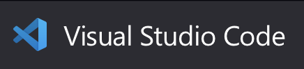
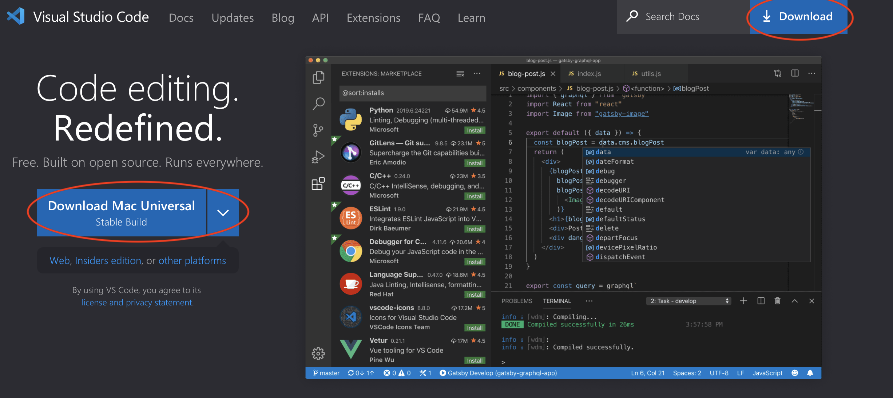

# Visual Studio Code

*Af Jeppe Veirum Larsen, opdateret 18/11 2022*

 

I undervisningen vil vi komme til at bruge code editoren Visual Studio Code (VS Code). Det er en meget populær code editor som kan bruges til nærmest alt. En af grundende til VS Codes popularitet er dens modulære opbygning der gør at den kan udvides med en masse ekstra funktionalitet, der gør det muligt at skrædersy den til lige netop det man skal bruge.

Dette dokument viser hvordan man henter og installere VS Code samt hvilke udvidelser vi skal bruge for at komme godt i gang.

## Installation

Det første vi skal er at downloade VS Code. Det er ikke så vigtigt hvor i installere det, det må bare ikke installeres i dynamiske mapper så som oneDrive, dropbox eller lignende.

 

🔗 [Download af VS Code](https://code.visualstudio.com/Download)

 

## Opret, åben og gem en fil

Dette er nok indlysende for de fleste, men vi gennemgår lige hvordan vi opretter en fil, åbner en mappe med forskellige filer samt hvordan vi gemmer en fil.

### Opret fil

For at oprette en fil skal i gå til *File > New File...* Det er vigtigt at i ikke vælger new text file da i så vil få en .txt fil som VS Code kun vil se som tekst. Vi vil gerne have den til at se filen som det programmeringssprog vi ønsker at bruge.

Når den nye fil er nyoprettet, og man ikke har givet den en filendelse, *(.xxx)* ved VS Code ikke hvilket programmeringssprog du ønsker at benytte. Til dette bruger den filendelsen *(.xxx)* så den ved hvordan den skal tolke hvad den ser i filen.

### Gem en fil
Det vigtigste er når vi gemmer en fil er at kontrollere om filen har en endelse og hvis ikke huske at give den det rigtige endelse når vi gemmer den første gang. 

**Et par eksempler på filendelser:**

- **.js** (JavaScript)
- **.py** (Python)
- **.txt** (Tekstfil)
- **.md** (Markdown)
- **.html** (Hyper Text Markup Language)
- **.css** (Custom Style Sheets)

### Åben en folder

Ofte har vi brug for nemt at danne os et overblik over en samling af filer da et program mange gange indeholder mange filer. Dette gøres ved at *File > Open Folder...* og så vælge den folder man ønsker at åbne.

## Extensions
Extensions er essentielle for VS Code. Uden extensions er VS Code bare *"endnu en anden kode-editor"*. Ved hjælp af extension kan VS Code skræddersyes lige præcis som man vil have det. 

Extension kan installeres ved at trykke på 'klods-ikonet' til venstre, se figur nedenfor.

INDSAT BILLEDE AF EXTENSION

VS Code anbefaler nogle extension, men hvis det man leder efter ikke er i recommended kan der søges ved hjælp af søgefeltet i toppen af Extensions. 

### Krævede Extensions

I programmering er der en række extensions vi skal bruge i undervisningen på forskellige måder. Nogle af dem udvider Vs Code med ekstra funktionalitet, andre gør det pænere og andre endnu gør vores liv lidt lettere.

#### Color Themes
Lad os starte ud med noget af det mest synlige. Det første der møder øjet er editoren og hvordan den ser ud. Der er allerede en del indbyggede themes, men på market place kan man finde en masse, hvis ikke de indbyggede er noget kan bruge. Følg linket neden under for en guide. 

🔗 [Color Themes Documentation](https://code.visualstudio.com/docs/getstarted/themes)

#### Vscode-icons
En ekstension som sætte små farvede ikoner foran filerne i et projekt for at man hurtigere kan genkende forskelige filtyper.

#### Prettier
For at undgå fejl og øge læsbarheden af kode kan denne ekstension auto-formatere din kode sådan at den er konsistent og ensartet.

Man kan vælge manuelt at køre Prettier eller man kan vælge at sætte den til at køre ved bestemte handlinger. 
En af de mest brugte handlinger til at kører Prettier er når man gemmer sin fil. Følg linket neden under for at formatere koden når i trykker ctrl/s eller cmd/s.

🔗 [Prettier - Format on svave!](https://scottsauber.com/2017/06/10/prettier-format-on-save-never-worry-about-formatting-javascript-again/)

#### Run Code
Et uundværligt værktøj når man hurtig skal prøve et stykke kode.

Installer. Herefter kan der højreklikket på koden og trykkes *Run Code*.

BILLEDE AF MENU

#### Live Server
En extension som gør det muligt at kører en lokal web-server. Dette skal primært bruges i tandem med p5.js bibloteket.

BILLEDE AF HVOR MAN SKAL TRYKKE OG AT DEN ÅBNER I BROWSER

